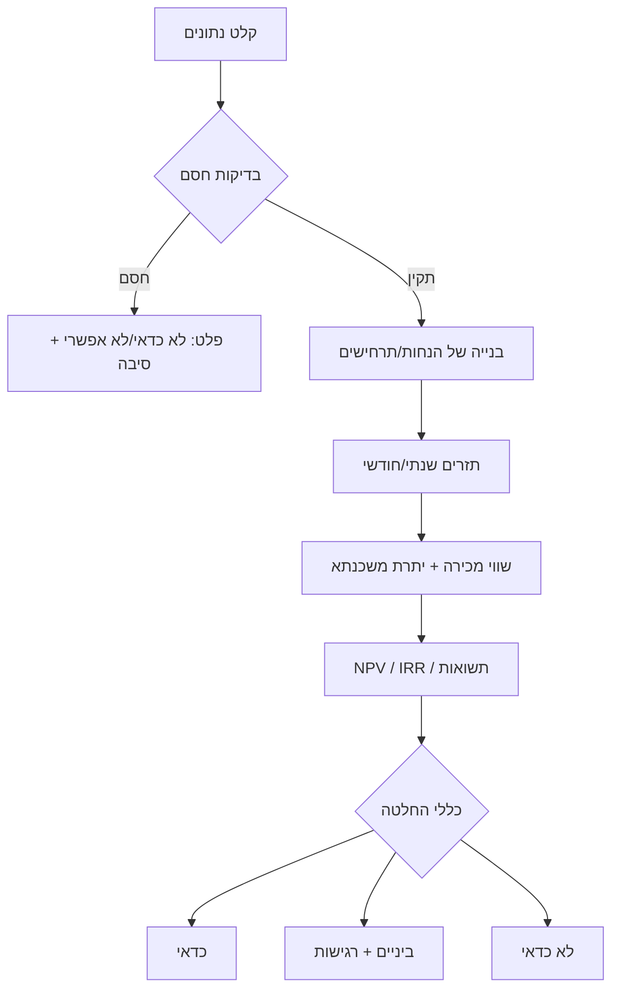
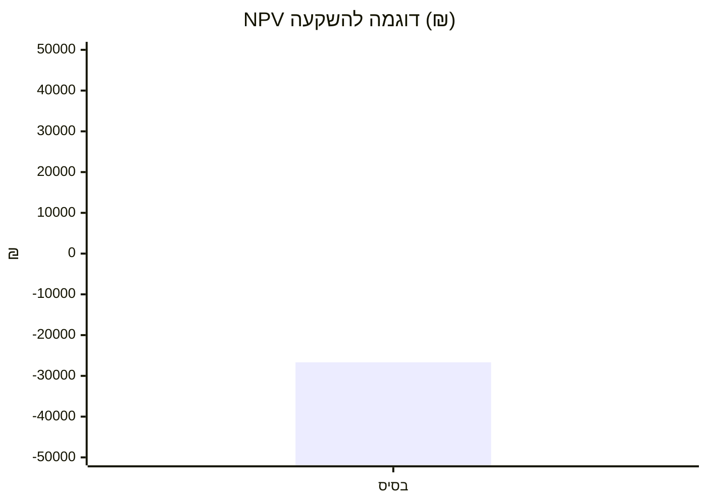
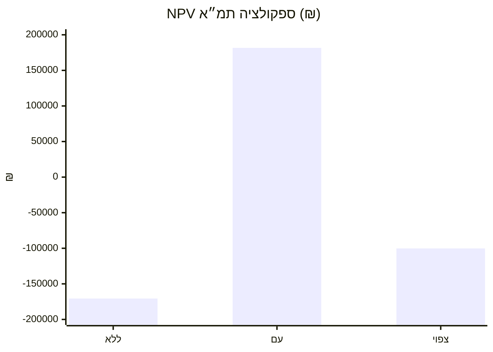

# Guideline.skill.md

## תקציר מנהלים
מסמך זה מגדיר “חוקי משחק” לבניית מודל החלטה קשיח (כן/לא/ביניים) לכדאיות רכישת דירה בישראל, על בסיס תזרים מזומנים, מיסוי, מגבלות מימון, ועלויות רכישה/אחזקה/מכירה. נקודת המוצא: החלטה טובה תלויה ב־(א) מחיר, (ב) תנאי מימון, (ג) מסים ועלויות חד־פעמיות, (ד) זרמי הכנסה/חיסכון שנתיים, (ה) תרחישי שווי עתידי ויציאה, (ו) תשואה אלטרנטיבית, ו־(ז) סיכוני תכנון–ביצוע (במיוחד בחיפה סביב סוף תמ״א 38).  
בחיפה: לפי עיריית חיפה, תמ״א 38 בעיר אמורה לפוג ב־18.5.2026 ובמקביל מקודמת “תכנית להתחדשות בניינית” כתחליף תכנוני. citeturn18view0 לכן למודל חייב להיות “מודול אי־ודאות” שמתרגם פוטנציאל התחדשות להסתברות, זמן מימוש, ועלות/סיכון, ולא מניח אוטומטית תוספת ערך.

## היקף, הגדרות ועקרונות
**מה המודל מחליט**: “כדאי” אם ההשקעה עוברת סף תשואה *אחרי* מסים וסיכונים *ובהשוואה* לחלופה (שכירות/השקעה פיננסית). “לא כדאי” אם לא. “ביניים” כאשר התוצאה תלויה מאוד בהנחות (רגישות גבוהה).  
**שני מצבים**:  
- **דירה להשקעה**: הכנסות שכ״ד פחות הוצאות ומימון, בתוספת שווי מכירה עתידי.  
- **דירה למגורים**: “הכנסה” היא **שכר דירה חלופי שנחסך** (imputed rent) + שווי מכירה עתידי.  
**הבחנה קריטית במימון**: מגבלות בנק ישראל על שיעור מימון (LTV) ועל פרופיל סיכון המשכנתא הן תנאי סף. לדירה יחידה LTV עד 75%, לדירה חליפית 70%, ולדירה להשקעה 50%. citeturn4view0 בנוסף קיימות מגבלות: יחס החזר מהכנסה עד 50%, רכיב ריבית משתנה עד 66.66%, ותקופה לפירעון סופי עד 30 שנים. citeturn17view0  
**הקשר תמ״א 38**: ברמה ארצית תוקף התמ״א פג ב־1.10.2023, אך בערים מסוימות ההוראות המשיכו/ממשיכות לחול עד 18.5.2026 או עד אישור תכנית חלופית—המוקדם מביניהם. citeturn0search8 (במודל: זה הופך ל”אופציה” ולא ל”וודאות”).  
**מע״מ**: החל מ־1.1.2025 שיעור המע״מ בישראל עלה ל־18% (רלוונטי בעיקר לרכישה מקבלן/עסקאות מסוימות). citeturn11search6turn11search12

## נתוני קלט נדרשים וכללי ולידציה
המודל צריך להחזיר תוצאה גם אם יש “לא צוין”; כל שדה שלא הוזן מסומן **לא צוין** ומונע קביעה “כדאי” אם הוא קריטי.

### תבנית קלט מינימלית
טבלת מפתחות (לערכים/יחידות):
| קבוצה | שדה | יחידה |
|---|---|---|
| נכס | עיר/שכונה/רחוב | טקסט |
| נכס | מחיר רכישה בחוזה | ₪ |
| לוחות זמנים | תאריך רכישה | YYYY-MM-DD |
| הון עצמי | הון עצמי זמין | ₪ |
| מימון | סכום משכנתא | ₪ |
| מימון | ריבית ממוצעת אפקטיבית | % לשנה |
| מיסוי רכישה | סטטוס: דירה יחידה/נוספת/חליפית | enum |
| שכ״ד | שכ״ד חודשי צפוי / שכ״ד חלופי | ₪/חודש |
| תפעול | שיעור תפוסה/ואקנסי | % |
| תפעול | ועד בית + תחזוקה | ₪/שנה |
| תפעול | ביטוח | ₪/שנה |
| תפעול | ארנונה לבעלים (אם רלוונטי) | ₪/שנה |
| הנחות שווי | עליית ערך שנתית | % לשנה |
| אופק | שנות החזקה | שנים |
| יציאה | עלות מכירה (תיווך/עו״ד וכו׳) | % מהמחיר |
| חלופה | תשואה אלטרנטיבית | % לשנה |

### שדות חובה מול רשות
**חובה**: מיקום, מחיר, תאריך/שנת רכישה, סטטוס מס רכישה (יחידה/נוספת/חליפית), הון עצמי, תנאי משכנתא, שכ״ד (או שכ״ד חלופי), אופק החזקה, עלויות רכישה ומכירה, תשואה אלטרנטיבית.  
**רשות אך מומלץ**: שיפוץ, ממ״ד/מקלט, גודל/חדרים, KPI לשוק (תפוסה), תרחיש התחדשות/תמ״א/פינוי־בינוי, תקרות פטור/מס שבח צפוי.

### כללי ולידציה (Data Validation)
כלל ולידציה צריך להחזיר: **תקין / אזהרה / חסם**.
- **מחיר רכישה**: >0 (חסם אם 0).  
- **הון עצמי**: ≥0 (חסם אם שלילי).  
- **LTV = משכנתא / מחיר**: חסם אם מעל המגבלה הרלוונטית (75%/70%/50%). citeturn4view0  
- **תקופת משכנתא**: חסם אם >30 שנים. citeturn17view0  
- **יחס החזר מהכנסה (PTI)**: חסם אם >50%; אזהרה חזקה כבר מעל 35% (Best practice). citeturn17view0  
- **ריבית משתנה**: חסם אם >66.66% מההלוואה; אזהרה אם >50%. citeturn17view0  
- **ואקנסי**: 0%–20% (אזהרה מעל 10%).  
- **עלות מכירה**: 0%–8% (אזהרה מעל 5%).  
- **עליית ערך**: ‎-5%–+10% לשנה (אזהרה מעל 6% כי זה הימור, לא מודל).

## הנחות ברירת מחדל וסנריו רגישות
הנחות ברירת מחדל קיימות כדי לאפשר הרצה כשחלק מהשדות “לא צוין”, אבל החלטת “כדאי” מותרת רק כשכל שדות החובה מלאים.

### ברירות מחדל מומלצות (טווחים)
- **ואקנסי**: 3% להשקעה; 0% למגורים.  
- **עלות אחזקה שנתית**: 0.5%–1.5% משווי הדירה (כולל בלאי/תיקונים), בנוסף לוועד בית אם קיים.  
- **עלות מכירה**: 2%–4% (תיווך + עו״ד + שונות).  
- **עליית ערך**: תרחישי בסיס 2%–3% לשנה; תרחיש שמרני 0%–1%; תרחיש שלילי ‎-2%.  
- **צמיחת שכ״ד**: 1%–3% לשנה.  
- **דיסקאונט (תשואה אלטרנטיבית)**: קלט חובה; אם לא צוין → אזהרה “לא ניתן לקבוע”.

### סנריו רגישות חובה
להריץ לפחות סט תרחישים:
- ריבית +1% / +2% מול בסיס (זעזוע מימון).
- עליית ערך 0% מול בסיס (קיפאון).
- ואקנסי כפול (שוכר יוצא/שוק חלש).
- עלויות יציאה גבוהות (מכירה “לחוצה”).
- “אירוע התחדשות” (אם רלוונטי): הסתברות נמוכה/בינונית/גבוהה + עיכוב בזמן.

## זרימת חישוב ונוסחאות
### שלבי חישוב
1) **עלות רכישה כוללת ביום 0**  
`Total_Upfront = הון עצמי מושקע + מס רכישה + שכר טרחה/בדיקות + שיפוץ + ריהוט`  
2) **משכנתא** (שפיצר כבסיס; מודל מתקדם: מסלולים)  
- תשלום חודשי:  
`PMT = L * r / (1 - (1+r)^(-N))`  
כאשר `r=ריבית חודשית`, `N=מס’ חודשים`.  
3) **תזרים שנתי**  
- להשקעה:  
`NetRent = Rent*(1-Vacancy) - OPEX`  
`CF_year = NetRent - MortgagePayments`  
- למגורים:  
`Benefit = RentEquivalent - OPEX - MortgagePayments`  
4) **שווי מכירה נטו בסוף אופק**  
`SaleGross = Price*(1+Appreciation)^T`  
`SaleNet = SaleGross*(1-SellCost%) - MortgageBalance(T) - TaxesOnSale(אם יש)`  
5) **מדדים**  
- `NPV = Σ CF_t / (1+AltReturn)^t`  
- `IRR = rate s.t. NPV=0`  
- **תשואה ברוטו**: `GrossYield = (Rent*12)/Price`  
- **תשואה נטו**: `NetYield = (RentEff - OPEX)/Price`  
- **Cash-on-Cash**: `CoC = AnnualNetCF / CashInvested`  
- **Break-even**: השנה שבה Σ תזרימים (מנוכים) עוברים 0.

### מודול “אופציית התחדשות” (בדגש חיפה/תמ״א)
אם לנכס יש פוטנציאל להתחדשות (תמ״א/תכנית בניינית/פינוי-בינוי), לא מכניסים “ערך נוסף” כוודאות, אלא:
- `p` = הסתברות אירוע (0–1).  
- `ΔV` = אחוז עליית שווי אם האירוע מצליח.  
- `Δt` = זמן עד אירוע.  
- `C_event` = עלות/הפסד נלווה (שכ״ד חלופי זמני, עו״ד, שיפורים).  
ואז:
- `NPV_expected = p*NPV_success + (1-p)*NPV_base`  
- **הסתברות איזון**:  
`p_break = -NPV_base / (NPV_success - NPV_base)`  
בחיפה: עצם חלון הזמן עד 18.5.2026 (סיום תמ״א בעיר) מכתיב ש־`p` תלוי בלו״ז התקדמות הפרויקט (הסכמות דיירים, יזם, הגשה, החלטות). citeturn18view0

## מדדים וכללי החלטה
### כללי החלטה קשיחים
הגדר ספים מראש (ניתנים לכיול):
- **כדאי** אם מתקיימים *כולם*:  
  - `NPV_base ≥ 0` **וגם** `IRR_base ≥ AltReturn + 1%`  
  - רגישות: ב־2 מתוך 3 תרחישי “רע” NPV לא יורד מתחת ל־`-2%` מהמחיר (שולי ביטחון).  
  - אין חסמי מימון (LTV/תקופה/PTI). citeturn4view0turn17view0  
- **לא כדאי** אם מתקיים אחד:  
  - `NPV_base < 0` **וגם** `IRR_base ≤ AltReturn`  
  - העסקה עוברת רק אם “אופציית התחדשות” מצליחה בהסתברות גבוהה לא סבירה (למשל p_break>50% כשאין היתכנות תכנונית).  
- **ביניים** אם:  
  - NPV סביב 0 (למשל בין ‎-2% ל־+2% מהמחיר) או IRR בתוך ±1% מהחלופה,  
  - או שההכרעה תלויה בפרמטר בודד לא יציב (ריבית, ΔV של התחדשות, זמן מכירה).

### סיווג תוצאה והסבר אוטומטי
המנוע צריך להחזיר גם “הסבר”:
- “כדאי בעיקר בגלל: שכ״ד/שכר דירה חלופי גבוה, הון עצמי גבוה, מס רכישה נמוך, ריבית טובה.”  
- “לא כדאי בעיקר בגלל: מס רכישה גבוה, תזרים שנתי שלילי עמוק, LTV לא אפשרי, תלות מוגזמת בתמ״א.”  
- “ביניים בגלל: רגישות גבוהה לריבית/שכ״ד/שווי מכירה.”

## מסגרת חוקית-מיסויית, חיפה, דוגמאות וסיכונים
### כללי מס בסיסיים שיש להעדיף לבדיקה
**מס רכישה** (קריטי ל-NPV, במיוחד למשקיעים):  
- לדירה יחידה (בתוקף 16.01.2024–15.01.2028): מדרגות 0% עד 1,978,745 ₪; 3.5% עד 2,347,040; 5% עד 6,055,070; 8% עד 20,183,565; 10% מעל. citeturn22view0  
- לכל דירה מעבר לדירה הראשונה (16.01.2024–31.12.2026): 8% עד 6,055,070 ₪; 10% מעל. citeturn22view0  
- בקנייה מקבלן: מס הרכישה מחושב על מחיר כולל מע״מ. citeturn22view0  

**היטל השבחה** (תכנון/זכויות בנייה):  
- כלל אצבע: היטל השבחה מבוסס על “השבחה” בעקבות פעולה תכנונית ונגבה ע״י הוועדה המקומית מכוח חוק התכנון והבנייה. citeturn13search6  
- בפרויקטי פינוי-בינוי: החל מ־1.5.2022 נקבע בחוק כי שיעור היטל השבחה יעמוד על 25%, עם אפשרות לקביעות/התאמות ברשויות. citeturn13search3  
(המודל חייב קלט “היטל השבחה צפוי” או לפחות בורר “0/25/50%” אם יש פרויקט התחדשות.)

**מע״מ**: רלוונטי בעיקר בהקשר רכישה מקבלן/תמחור. בישראל המע״מ 18% החל 1.1.2025. citeturn11search6turn11search12  

### חיפה ותמ״א 38
- עיריית חיפה מצהירה שתמ״א 38 בחיפה תפוג ב־18.5.2026 ושגובשה/מגובשת תכנית “התחדשות בניינית” כתחליף. citeturn18view0  
- מדיניות עירונית היסטורית (דוגמה): מסמך המדיניות חל על מבנים שנבנו כדין לפני 1.1.1980, ומכיל הוראות מעבר לתיקים בשלבי ביניים. citeturn18view0  
במודל: כל “פרמיית התחדשות” בחיפה אחרי 15.2.2026 חייבת להגיע עם לו״ז והסתברות; אחרת מסווגים כ”ביניים/לא כדאי”.

### דוגמאות טיפוסיות ושלוש דוגמאות מחושבות
**הנחות שלא נמסרו** מסומנות כאן כ”לא צוין”; המספרים להדגמה בלבד.

#### דוגמה מחושבת להשקעה להשכרה
- מחיר: 2,000,000 ₪  
- מס רכישה למשקיע: 8% = 160,000 ₪ (כל דירה מעבר לראשונה). citeturn22view0  
- הון עצמי: 600,000 ₪; משכנתא: 1,400,000 ₪ (LTV 70% תקין). citeturn4view0  
- שכ״ד: 7,500 ₪; ואקנסי 3%; אחזקה+ועד+ביטוח: ~25,500 ₪/שנה; אופק 10 שנים; עליית ערך 3%; תשואה אלטרנטיבית 5%.  
**תוצאה (לפי תזרים):** NPV≈ ‎-26.7k ₪; IRR≈4.7% ⇒ “ביניים/לא כדאי” כי המס מכביד וה-IRR לא עובר את החלופה.

#### דוגמה מחושבת למגורים עם פוטנציאל התחדשות בחיפה
מבוסס חלקית על נתונים שסיפקת בקובץ (מחיר/שיפוץ/משכנתא). fileciteturn1file0L2-L60  
- מחיר חוזה: 1,300,000 ₪. fileciteturn1file0L2-L6  
- שיפוץ+ריהוט: 247,000 ₪. fileciteturn1file0L24-L32  
- רכישה דירה יחידה: מס רכישה 0% עד 1,978,745 ₪ (כל עוד אכן “דירה יחידה”). citeturn22view0  
- מימון: אם זו דירה יחידה, LTV חייב ≤75%. citeturn4view0 (בקובץ מופיעה משכנתא 1,200,000 ₪ על מחיר 1,300,000 ₪ → LTV≈92% ⇒ **חסם**). fileciteturn1file0L56-L60  
**תרחיש מתוקן להרצה** (כדי לא להיתקע בחסם): משכנתא 975,000 ₪ (75%); ריבית 4.48%; 30 שנה (תקין). citeturn17view0  
- שכ״ד חלופי שנחסך: לא צוין (קלט חובה).  
**תובנה**: המודל יחזיר “ביניים/לא אפשרי” עד שתשלים: שכ״ד חלופי, הכנסה חודשית (ל-PTI), ותרחיש התחדשות עם הסתברות. בחיפה, עצם פקיעת התמ״א ב־18.5.2026 מגדילה את אי־הוודאות לערך “דחיפה” ולכן מחייבת p וזמן מימוש. citeturn18view0  

#### דוגמה מחושבת לרכישה ספקולטיבית לפני דדליין תמ״א בחיפה
- הנחת מפתח: תמ״א בחיפה אמורה לפוג ב־18.5.2026. citeturn18view0  
- מחיר: 1,500,000 ₪; משכנתא 75%; שכ״ד 5,500 ₪; מס רכישה למשקיע 8% (אם זו דירה נוספת). citeturn22view0  
- “אופציית תמ״א”: אם מצליחים, תוספת ערך +30% בעוד 3 שנים; הסתברות p=20% (לא צוין—דוגמה).  
**תוצאה (מחושבת):**  
- ללא תמ״א: NPV≈ ‎-170.6k; IRR≈ ‎-1.2%  
- עם הצלחת אופציה: NPV≈ +181.6k; IRR≈ 12.0%  
- **NPV צפוי** (p=20%): ≈ ‎-100.2k ⇒ “לא כדאי”; נדרש p_break≈48% כדי להגיע לאיזון.

### צ׳ק-ליסט סיכונים וצעדי מיתון
סיכוני ליבה (לסמן כן/לא ולהוסיף פעולה):
- **סיכון מימון**: LTV/PTI/מסלול ריבית משתנה → לבקש אישור עקרוני ולוודא עמידה במגבלות. citeturn4view0turn17view0  
- **סיכון תכנוני/התחדשות**: בחיפה אחרי 15.2.2026 יש חלון עד 18.5.2026 לתמ״א; מעבר לכך תלות בתכנית חלופית/מסלולים אחרים. citeturn18view0  
- **סיכון מס**: מס רכישה/מסי יציאה/היטל השבחה → להריץ סימולציה עם מדרגות נכונות ולהגדיר Worst-case. citeturn22view0turn13search3  
- **סיכון הנדסי**: ליקויים/רטיבות/עמידות → בדק בית + מהנדס.  
- **סיכון שכירות**: שוכר בעייתי/ואקנסי → ביטחונות, בדיקת שוק, מרווח ביטחון.  
- **סיכון נזילות**: מכירה בלחץ → להעלות עלויות יציאה ולבחון NPV בתרחיש “מכירה מהירה”.

### צעדים מומלצים לפני החלטה
- בדיקת **זכויות תכנוניות** (תב״ע, היתרים קודמים, סטטוס התחדשות).  
- **בדיקה משפטית**: נסח טאבו/הערות אזהרה/שעבודים/חריגות בנייה.  
- **בדיקה הנדסית**: בדק בית + הערכת עלויות שיפוץ ריאליות.  
- **Pre-approval מימון**: אישור עקרוני + בדיקת PTI/LTV לפי כללי בנק ישראל. citeturn4view0turn17view0  
- הרצה במודל בשלושה מצבים: בסיס / שמרני / “רע”, ורק אז קבלת החלטה.